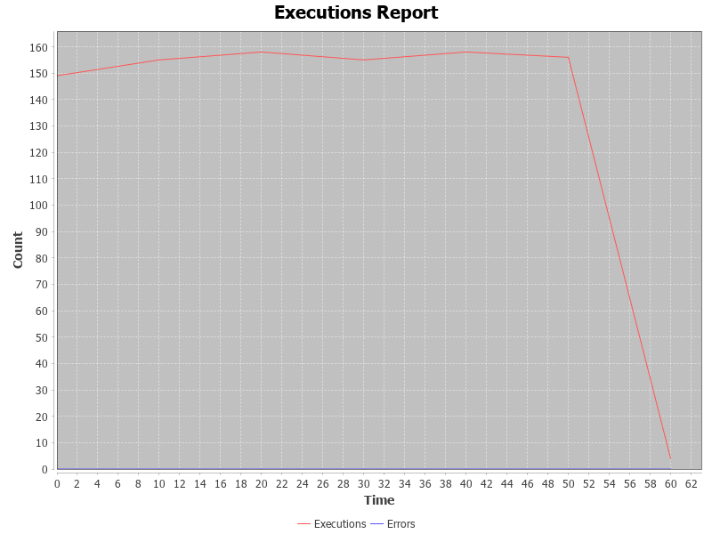
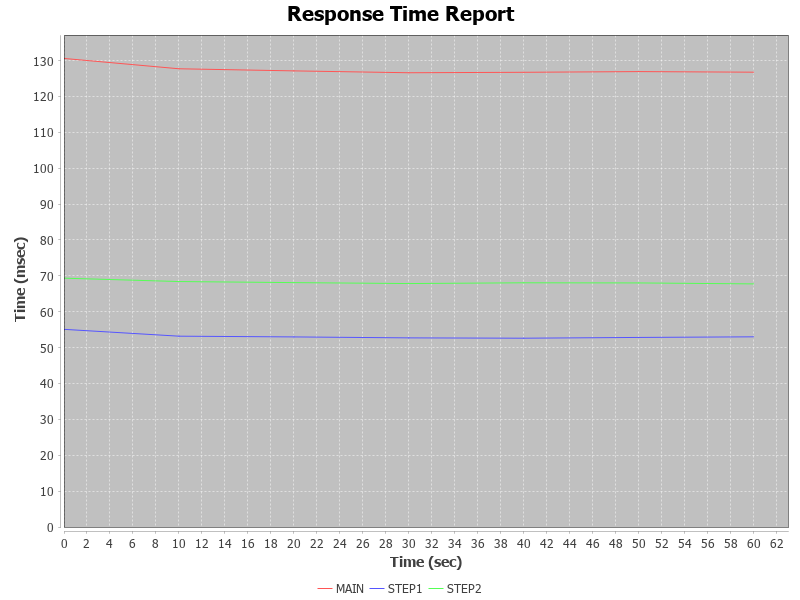
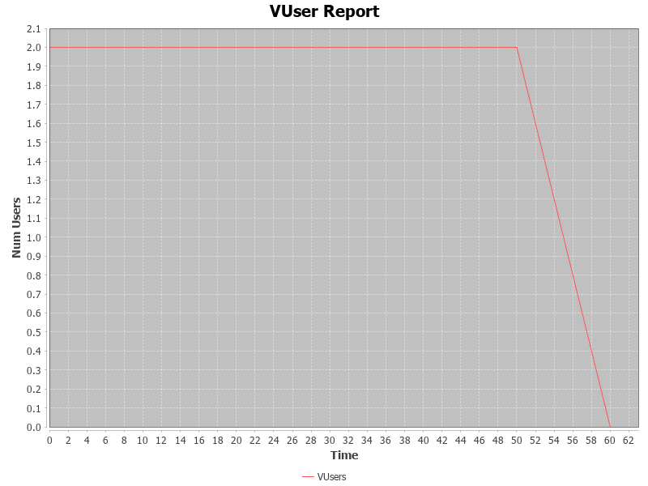

# Hailstorm: Simple Integration and Load Testing Tool
Java 11 includes support for JEP 330, Launch Single-File Source-Code Programs. This feature allows you to execute a Java source code file directly using the java interpreter. The source code is compiled in memory and then executed by the interpreter, without producing a .class file on disk.
This enables using Java similar to a scripting language. With earlier precompiled java frameworks, People used to put a lot of stuff in configration files. Now its no longer needed people can create easily editable scripts and use them on the go. 
Check the examples included in the folder src/test/java
Also take a look at the sister project funxion.io/FunxionServiceTest/src/main/java/io/funxion . The test scripts for testing www.funxion.io are located there. 
## Build
```
mvn clean package
```
## Sample Code
```
import java.net.URI;
import java.net.http.HttpRequest;
import java.net.http.HttpResponse;
import java.net.http.HttpResponse.BodyHandlers;

import io.funxion.hailstorm.TestCase;

public class Test {
	public static void main(String[] args) {
		TestCase testCase = new  TestCase() {
			@Override
			protected void execute() throws Exception {
				startStep("STEP1");
				String URLString = "https://jsonplaceholder.typicode.com/todos/1";
				HttpRequest request1 = HttpRequest.newBuilder()
				.uri(URI.create(URLString))
				.GET()   
				.build();
				HttpResponse<String> response1 = httpClient.send(request1, BodyHandlers.ofString());					
				endStep("STEP1");
			}
		};	
		testCase.start(args);
	}
	
}
```
## Usage
The following Commands rely on a mock local service. Run the java program src\test\java\MockService.java to start the service. 
```
setEnv.bat
```
### Help Mode
```
java src/test/java/Test1.java -h
Invoked in Help Mode
usage: TestBench
 -ap,--authPassword <arg>     Password for Authentication
 -au,--authUser <arg>         UserName used for Authentication
 -ct,--connectTimeout <arg>   Connect Timeout in seconds
 -d,--duration <arg>          Test duration in seconds
 -gg,--gengraph               Generate Graph
 -h,--help                    Print Help
 -i,--iterations <arg>        Iterations Count
 -lp,--loadPlan <arg>         Load Plan sec:vusers,sec:vusers,...
 -o,--outputFolder <arg>      Output Folder
 -ph,--proxyHost <arg>        Proxy Host
 -pm,--printMetric <arg>      Print Current Metric every N seconds
 -pp,--proxyPort <arg>        Proxy Port
 -rr,--rampRate <arg>         Ramp Rate No of VUsers increment per second
 -tp,--throughput <arg>       Max Throughput
 -v,--vusers <arg>            No of Virtual Users
 -x,--verbose                 Verbose Output for debugging
```
### Functional Mode
```
java src/test/java/Test1.java 
--------------------------------------------------------------------------------
Configuration [vUsers=1, iterations=2147483647, duration=0, printMetric=0, connectTimeout=PT10S, authUser=null, authPassword=null, proxyHost=null, proxyPort=null, functionalMode=true, verbose=false, throughput=0, gengraph=false, rampRate=0, testEndTime=2019-11-27T02:49:57.915034500Z, outputFolder=report]
STEP:STEP1                170(ms)     SUCCESS
STEP:STEP2                 70(ms)     SUCCESS
STEP:MAIN                 265(ms)     SUCCESS
--------------------------------------------------------------------------------
TEST_START:Nov 16, 2019, 6:49:57 PM
TEST_END:Nov 16, 2019, 6:49:59 PM
DURATION:1 Seconds
--------------------------------------------------------------------------------
```
### LoadTest Mode
```
java src/test/java/Test1.java -v 2 -i 100  
--------------------------------------------------------------------------------
Configuration [vUsers=2, iterations=100, duration=0, printMetric=0, connectTimeout=PT10S, authUser=null, authPassword=null, proxyHost=null, proxyPort=null, functionalMode=false, verbose=false, throughput=0, gengraph=false, rampRate=0, testEndTime=2019-11-27T02:50:00.528219900Z, outputFolder=report]
EXECUTIONS=200 : ERRORS=0 : MAIN : 130.91 : STEP1 : 54.85 : STEP2 : 69.0
--------------------------------------------------------------------------------
STEP:STEP1       , MIN:       51.00, MAX:      193.00, MEAN:       54.85
STEP:STEP2       , MIN:       65.00, MAX:       76.00, MEAN:       69.07
--------------------------------------------------------------------------------
SUCCESSFUL_EXECUTION:200, MIN:      124.00, MAX:      289.00, MEAN:      130.91
FAILED_EXECUTION:0,FAILED_PERCENTAGE 0.00
--------------------------------------------------------------------------------
TEST_START:Nov 16, 2019, 6:50:00 PM
TEST_END:Nov 16, 2019, 6:50:14 PM
DURATION:14 Seconds
--------------------------------------------------------------------------------
```
### With Tracking Output every 10 seconds. 
```
java src/test/java/Test1.java -v 2 -i 200 -pm 10 
--------------------------------------------------------------------------------
Configuration [vUsers=2, iterations=200, duration=0, printMetric=10, connectTimeout=PT10S, authUser=null, authPassword=null, proxyHost=null, proxyPort=null, functionalMode=false, verbose=false, throughput=0, gengraph=false, rampRate=0, testEndTime=2019-11-27T02:50:16.132674300Z, outputFolder=report]
--------------------------------------------------------------------------------
EXECUTIONS=150 : ERRORS=0 : MAIN : 131.81 : STEP1 : 55.02 : STEP2 : 69.2
EXECUTIONS=156 : ERRORS=0 : MAIN : 127.74 : STEP1 : 53.33 : STEP2 : 68.4
EXECUTIONS=94 : ERRORS=0 : MAIN : 127.86 : STEP1 : 53.29 : STEP2 : 68.4
--------------------------------------------------------------------------------
STEP:STEP1       , MIN:       50.00, MAX:      193.00, MEAN:       53.96
STEP:STEP2       , MIN:       65.00, MAX:       79.00, MEAN:       68.78
--------------------------------------------------------------------------------
SUCCESSFUL_EXECUTION:400, MIN:      123.00, MAX:      296.00, MEAN:      129.29
FAILED_EXECUTION:0,FAILED_PERCENTAGE 0.00
--------------------------------------------------------------------------------
TEST_START:Nov 16, 2019, 6:50:16 PM
TEST_END:Nov 16, 2019, 6:50:43 PM
DURATION:26 Seconds
--------------------------------------------------------------------------------
```
### With Defined Duration
```
java src/test/java/Test1.java -v 2 -d 20
--------------------------------------------------------------------------------
Configuration [vUsers=2, iterations=2147483647, duration=20, printMetric=0, connectTimeout=PT10S, authUser=null, authPassword=null, proxyHost=null, proxyPort=null, functionalMode=false, verbose=false, throughput=0, gengraph=false, rampRate=0, testEndTime=2019-11-17T02:51:04.246685200Z, outputFolder=report]
EXECUTIONS=310 : ERRORS=0 : MAIN : 129.45 : STEP1 : 54.04 : STEP2 : 68.8
--------------------------------------------------------------------------------
STEP:STEP1       , MIN:       50.00, MAX:      191.00, MEAN:       54.04
STEP:STEP2       , MIN:       65.00, MAX:       83.00, MEAN:       68.83
--------------------------------------------------------------------------------
SUCCESSFUL_EXECUTION:310, MIN:      122.00, MAX:      297.00, MEAN:      129.45
FAILED_EXECUTION:0,FAILED_PERCENTAGE 0.00
--------------------------------------------------------------------------------
TEST_START:Nov 16, 2019, 6:50:44 PM
TEST_END:Nov 16, 2019, 6:51:05 PM
DURATION:20 Seconds
--------------------------------------------------------------------------------
```
### Functional Mode with Debug on
```
java src/test/java/Test1.java -x
--------------------------------------------------------------------------------
Configuration [vUsers=1, iterations=2147483647, duration=0, printMetric=0, connectTimeout=PT10S, authUser=null, authPassword=null, proxyHost=null, proxyPort=null, functionalMode=true, verbose=true, throughput=0, gengraph=false, rampRate=0, testEndTime=2019-11-27T02:51:06.383707200Z, outputFolder=report]
HTTP Status Code step1 :200
STEP:STEP1                169(ms)     SUCCESS
HTTP Status Code step2 :200
STEP:STEP2                 85(ms)     SUCCESS
STEP:MAIN                 277(ms)     SUCCESS
Waiting for Executor to shutdown...Running Threads=0
--------------------------------------------------------------------------------
TEST_START:Nov 16, 2019, 6:51:06 PM
TEST_END:Nov 16, 2019, 6:51:07 PM
DURATION:1 Seconds
--------------------------------------------------------------------------------
```
### Execution Stopped with Ctrl + c
```
java src/test/java/Test1.java -v 2 -d 60  -pm 10
--------------------------------------------------------------------------------
Configuration [vUsers=2, iterations=2147483647, duration=60, printMetric=10, connectTimeout=PT10S, authUser=null, authPassword=null, proxyHost=null, proxyPort=null, functionalMode=false, verbose=false, throughput=0, gengraph=false, rampRate=0, testEndTime=2019-11-17T02:52:09.022485300Z, outputFolder=report]
--------------------------------------------------------------------------------
EXECUTIONS=150 : ERRORS=0 : MAIN : 131.37 : STEP1 : 55.03 : STEP2 : 69.1
EXECUTIONS=158 : ERRORS=0 : MAIN : 127.11 : STEP1 : 53.10 : STEP2 : 68.0
EXECUTIONS=156 : ERRORS=0 : MAIN : 127.03 : STEP1 : 52.84 : STEP2 : 68.1
EXECUTIONS=157 : ERRORS=0 : MAIN : 126.67 : STEP1 : 52.72 : STEP2 : 68.0
EXECUTIONS=156 : ERRORS=0 : MAIN : 126.60 : STEP1 : 52.44 : STEP2 : 68.1
EXECUTIONS=158 : ERRORS=0 : MAIN : 126.95 : STEP1 : 52.84 : STEP2 : 68.1
EXECUTIONS=2 : ERRORS=0 : MAIN : 128.50 : STEP1 : 54.00 : STEP2 : 68.5
--------------------------------------------------------------------------------
STEP:STEP1       , MIN:       50.00, MAX:      190.00, MEAN:       53.15
STEP:STEP2       , MIN:       65.00, MAX:       88.00, MEAN:       68.25
--------------------------------------------------------------------------------
SUCCESSFUL_EXECUTION:938, MIN:      122.00, MAX:      282.00, MEAN:      127.59
FAILED_EXECUTION:0,FAILED_PERCENTAGE 0.00
--------------------------------------------------------------------------------
TEST_START:Nov 16, 2019, 6:51:09 PM
TEST_END:Nov 16, 2019, 6:52:09 PM
DURATION:60 Seconds
--------------------------------------------------------------------------------
```
### With Graph Generated and output redirected to reports folder
```
java src/test/java/Test1.java -v 2 -d 60 -pm 10 -gg -o sample_reports
--------------------------------------------------------------------------------
Configuration [vUsers=2, iterations=2147483647, duration=60, printMetric=10, connectTimeout=PT10S, authUser=null, authPassword=null, proxyHost=null, proxyPort=null, functionalMode=false, verbose=false, throughput=0, gengraph=true, rampRate=0, testEndTime=2019-11-17T02:53:11.162176500Z, outputFolder=sample_reports]
--------------------------------------------------------------------------------
EXECUTIONS=150 : ERRORS=0 : MAIN : 131.23 : STEP1 : 54.81 : STEP2 : 69.0
EXECUTIONS=156 : ERRORS=0 : MAIN : 127.87 : STEP1 : 53.25 : STEP2 : 68.6
EXECUTIONS=158 : ERRORS=0 : MAIN : 127.22 : STEP1 : 52.97 : STEP2 : 68.3
EXECUTIONS=156 : ERRORS=0 : MAIN : 126.84 : STEP1 : 52.91 : STEP2 : 67.9
EXECUTIONS=158 : ERRORS=0 : MAIN : 126.80 : STEP1 : 52.70 : STEP2 : 67.9
EXECUTIONS=155 : ERRORS=0 : MAIN : 126.69 : STEP1 : 52.61 : STEP2 : 68.0
EXECUTIONS=4 : ERRORS=0 : MAIN : 127.50 : STEP1 : 53.50 : STEP2 : 68.5
--------------------------------------------------------------------------------
STEP:STEP1       , MIN:       50.00, MAX:      195.00, MEAN:       53.20
STEP:STEP2       , MIN:       65.00, MAX:       75.00, MEAN:       68.31
--------------------------------------------------------------------------------
SUCCESSFUL_EXECUTION:938, MIN:      122.00, MAX:      294.00, MEAN:      127.75
FAILED_EXECUTION:0,FAILED_PERCENTAGE 0.00
--------------------------------------------------------------------------------
TEST_START:Nov 16, 2019, 6:52:11 PM
TEST_END:Nov 16, 2019, 6:53:12 PM
DURATION:60 Seconds
--------------------------------------------------------------------------------
Generating Summary Chart in the folder sample_reports
--------------------------------------------------------------------------------
```
### Sample Graphs



